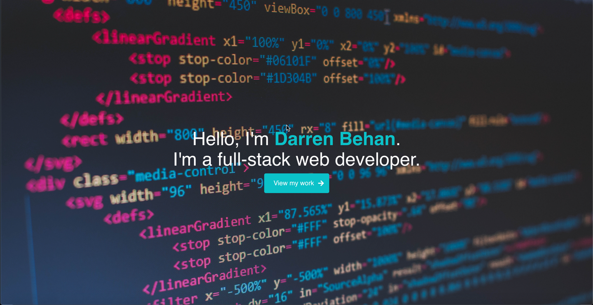

        

  # Welcome to my Portfolio Repository 👋

  ## Description

  📚 I've developed my `portfolio` at the start of my journey to becoming a full-stack web developer. I have re-imagined the layout of the UI as I've progressed through the `bootcamp` I've been enrolled in to represent the new skills I've developed. Feel free to `contact me` at any time.

  ## Table of Contents 🗂

  * [Description](#Description)
  * [Installation](#Installation)
  * [Usage](#Usage)
  * [License](#License)
  * [Version](#Version)
  * [Contributing](#Contributing)
  * [Tests](#Tests)
  * [Questions](#Questions)

  ## Installation

  ⚙️ n/a

  ## Usage

  🚨 View my portfolio <a href="https://darren-behan.github.io">here</a>

  

  ## License

  🖋 

  This app is not using a license

  ## Version

  ℣ 

  ## Contributing

  👩‍💻 n/a

  ## Tests

  🧪 n/a

  ## Questions

  🌍 https://github.com/darren-behan

  📧 me at darrenbehan@hotmail.com

  
